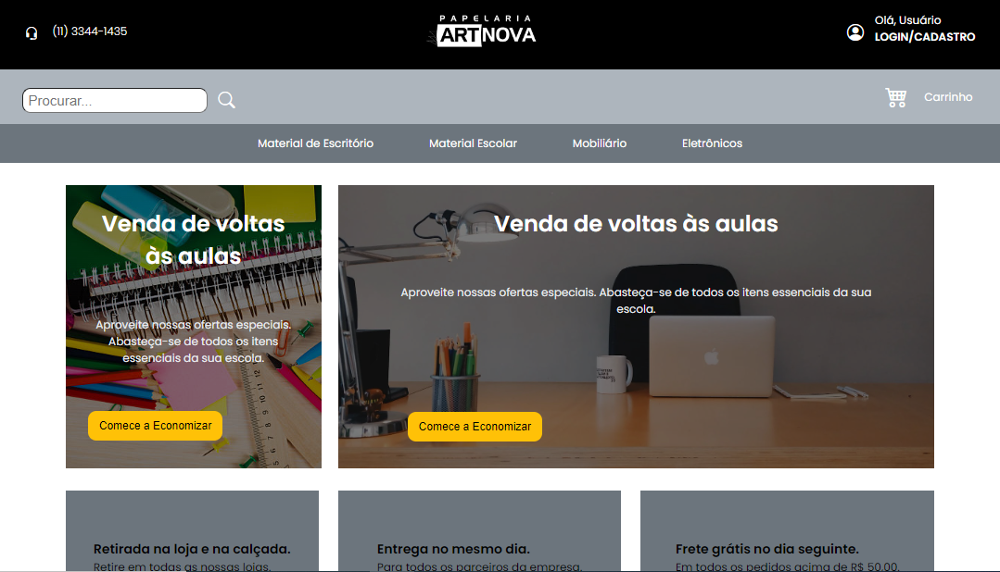

Projeto finalizado

 

  

## 🚀 Tecnologias

Esse projeto foi desenvolvido com as seguintes tecnologias:

- HTML e CSS
- Git e Github

## 💻 Projeto

Projeto de um site de uma Papelaria desenvolvido com Html, Css e Git Hub.

## :memo: Licença

Esse projeto está sob a licença MIT.

---

Feito com ♥ by Willian Bredoff :wave: